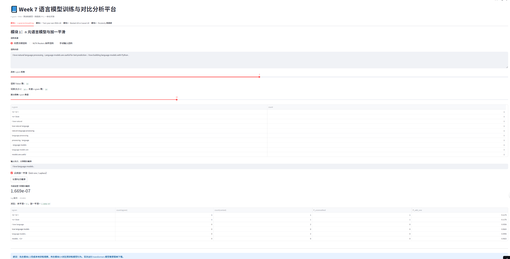
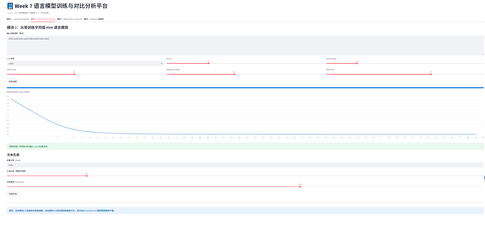
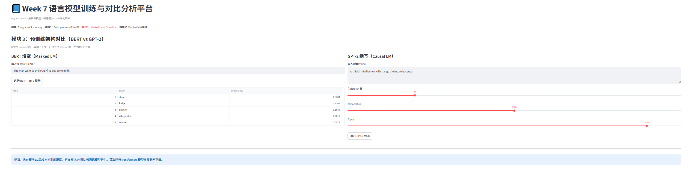
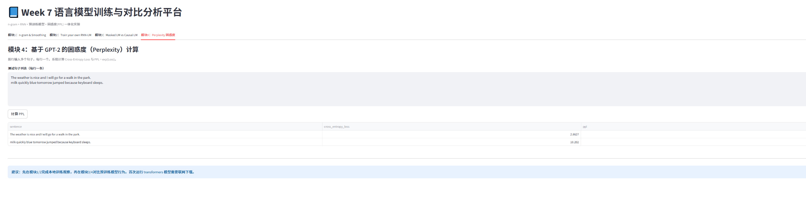

# Week 7 随堂 Vibe 实验报告

## 一、实验基本信息

- 课程主题：语言模型训练与对比分析平台
- 实验日期：2026-04-16
- 报告人姓名：裘典儿
- 学号：2025213456
- 在线访问地址：https://qiudianer-o56yrlk6wndom2xigbeh8k.streamlit.app/

## 二、AI 辅助工具与模型声明

| 项目 | 内容 |
|---|---|
| AI 编程工具 | Codex |
| 使用模型 | Codex（GPT-5.4） |
| 主要辅助内容 | 代码生成、模块联调、实验报告整理与网页化 |

## 三、实验任务与实现情况

本实验使用 Streamlit 构建四标签页系统，集成 `nltk`、`torch`、`transformers`，并完成如下模块：

1. **n-gram 与加一平滑**：支持语料输入、n 阶选择、句子联合概率计算、平滑前后对比。
2. **字符级 RNN/LSTM 训练**：支持自定义语料与超参数配置，训练过程实时展示 Loss 曲线，训练后可按 Seed 生成文本。
3. **BERT vs GPT-2 对比**：BERT 做 `[MASK]` Top-5 预测，GPT-2 做前缀续写，页面并排展示机制差异。
4. **PPL 困惑度计算**：基于 GPT-2 计算句子交叉熵损失与困惑度，表格输出对比结果。

## 四、实验观察结论

1. 当输入句子包含语料中未出现的 n-gram 时，未平滑模型联合概率会出现归零；启用 Add-one 后概率变为非零，缓解数据稀疏问题。  
2. 字符级 RNN 在规律文本（如 `hello world` 重复串）上可快速下降 Loss，并生成相似模式文本，体现隐藏状态对历史信息的建模能力。  
3. BERT 能利用 `[MASK]` 两侧上下文进行双向填空；GPT-2 采用严格左到右自回归续写。  
4. 通顺句通常具有更低 PPL，随机拼接句通常具有更高 PPL，符合“PPL 越低建模越好”的课程结论。  

## 五、运行结果截图（按模块对应）

### 模块1：n-gram 与加一平滑



### 模块2：从零训练字符级 RNN-LM



### 模块3：预训练架构对比（BERT vs GPT-2）



### 模块4：GPT-2 困惑度（PPL）计算



## 六、实验使用 Prompt（核心）

```
请基于 Streamlit 构建“语言模型训练与对比分析平台”，包含四个标签页：
1) n-gram 与 Add-one Smoothing：可输入语料，构建 Trigram/Bigram，计算句子联合概率并对比平滑前后结果；
2) 从零训练字符级 RNN/LSTM：支持 Hidden Size、Epochs、Learning Rate 调参，实时显示 Loss 曲线，并基于 Seed 生成文本；
3) 预训练模型对比：使用 bert-base-uncased 完成 [MASK] Top-5 预测，使用 gpt2 执行前缀续写；
4) PPL 计算：基于 GPT-2 计算多句文本的 Cross-Entropy Loss 与 PPL=exp(Loss)，表格展示结果。
```

## 七、关键文件与提交材料

- 核心代码：`app.py`（完整 Week7 版本）
- 运行依赖：`requirements.txt`
- 网页报告：`Week7_实验报告_可视化.html`
- 文本报告：`Week7_实验报告.md`
- 截图目录：`assets/week7_module1.png` ~ `assets/week7_module4.png`

## 八、综合结论

统计模型可解释性强但受稀疏性影响明显；RNN 能学习序列规律但依赖训练语料与参数；预训练模型在泛化与文本建模方面表现更强。通过统一平台对比，可以直观观察不同架构在“训练成本、效果、可解释性”三方面的取舍关系。
